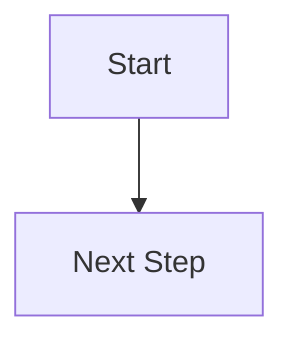

# Contributing to CC Club Website (Developer Guide)

> **📋 Note:** This guide is for **developers** working on website code, features, and bug fixes.  
> **For blog post contributions**, see [CONTRIBUTING_BLOG.md](CONTRIBUTING_BLOG.md)  
> **For content updates** (events, team, projects), contact CC Club maintainers.

Thank you for your interest in contributing to the Computer Coding Club website! This guide will help you understand the technical architecture and contribute code effectively.

## Table of Contents

- [Quick Start for Developers](#quick-start-for-developers)
- [Understanding Zola](#understanding-zola)
- [Project Architecture](#project-architecture)
- [Working with Templates](#working-with-templates)
- [Theme Development](#theme-development)
- [Adding New Features](#adding-new-features)
- [Debugging & Troubleshooting](#debugging--troubleshooting)
- [Code Quality & Best Practices](#code-quality--best-practices)
- [Development Workflow](#development-workflow)
- [Testing](#testing)
- [Pull Request Guidelines](#pull-request-guidelines)
- [Resources & Documentation](#resources--documentation)

---

## Quick Start for Developers

### Prerequisites

- **Git** installed on your computer
- **Zola v0.21** installed ([Download here](https://github.com/getzola/zola/releases/tag/v0.21.0))
  - ⚠️ **Important:** Use exactly v0.21 - v0.22+ will break the build
  - Avoid package managers (apt, brew) as they install incompatible versions
- **Code editor** (VS Code recommended)
- **GitHub account**
- **Basic knowledge of:**
  - HTML/CSS
  - Git workflow
  - Terminal/command line

### Setup Steps

1. **Fork and clone the repository:**
   ```bash
   git clone --recursive https://github.com/YOUR-USERNAME/cc-website.git
   cd cc-website
   ```

2. **Initialize theme submodule** (if not using `--recursive`):
   ```bash
   git submodule update --init --recursive
   ```

3. **Start development server:**
   ```bash
   zola serve
   # Visit http://127.0.0.1:1111
   # Server will auto-reload on file changes
   ```

4. **Make your changes** and test locally

5. **Create a Pull Request** when ready

---

## Understanding Zola

### What is Zola?

[Zola](https://www.getzola.org/) is a fast static site generator written in Rust. It compiles your content (Markdown files) and templates into a static website.

**Key Concepts:**

- **Static Site Generator**: Builds HTML files at build time, not runtime
- **No Runtime Dependencies**: Generated site is just HTML/CSS/JS
- **Fast Builds**: Rust-powered compilation
- **Hot Reload**: Development server updates instantly on file changes

### How Zola Works

```
Markdown Content + Templates + Data → Zola Build → Static HTML Site
```

1. **Content** (`content/*.md`) - Your pages and blog posts
2. **Templates** (`templates/*.html`) - Page layouts using Tera syntax
3. **Static Assets** (`static/`) - CSS, JS, images
4. **Data** (`data/*.toml`) - Structured data (team, projects)
5. **Config** (`config.toml`) - Site configuration

**Build Process:**
```bash
zola build    # Compiles everything to public/
zola serve    # Development server with hot reload
zola check    # Validate content and links
```

### Directory Structure

```
cc-website/
├── config.toml           # Site configuration
├── content/              # Markdown content
│   ├── _index.md        # Home page
│   ├── blog/            # Blog posts
│   ├── events/          # Events
│   └── roadmaps/        # Learning roadmaps
├── templates/            # Custom templates
│   ├── index.html       # Homepage template
│   ├── blog.html        # Blog listing
│   └── team.html        # Team page
├── static/               # Static assets
│   ├── css/
│   ├── images/
│   └── js/
├── data/                 # TOML data files
│   ├── team.toml        # Team members
│   └── projects.toml    # Projects
└── themes/goyo/          # Goyo theme (submodule)
```

### Configuration (`config.toml`)

The `config.toml` file controls site-wide settings:

```toml
base_url = "https://cc-club.in/"
title = "Computer Coding Club"
description = "Official website of Computer Coding Club - Learn, Build, and Grow Together"
theme = "goyo"
compile_sass = true
build_search_index = true
default_language = "en"
generate_feeds = true
generate_sitemap = true

# Taxonomies for content organization
taxonomies = [
    {name = "tags", feed = true, paginate_by = 10},
    {name = "categories", paginate_by = 10},
]

[markdown]
highlight_code = true
highlight_theme = "ayu-mirage"

[extra]
# Theme settings
[extra.theme]
colorset = "dark"
brightness = "normal"
# ... more custom variables (see full config.toml)
```

**Important sections:**
- `base_url` - Production URL (**critical for deployment**)
- `theme` - Theme name (must match folder in `themes/`)
- `[extra]` - Custom variables accessible in templates
- `[extra.theme]` - Theme configuration
- `taxonomies` - Content categorization (tags, categories)
- `build_search_index` - Enables full-text search

**⚠️ Critical: Using `get_url` for Links**

Always use `get_url()` function for internal links in templates to prevent broken links in deployment:

```html
<!-- ❌ WRONG - Will break in deployment -->
<a href="/blog">Blog</a>


<!-- ✅ CORRECT - Works everywhere -->
<a href="{{ get_url(path="@/blog/_index.md") }}">Blog</a>


<!-- For static assets in static/ -->

```

**Why this matters:**
- `get_url()` adapts to `base_url` automatically
- Prevents broken links when deploying to subdirectories
- Validates paths at build time (catches typos early)

### Essential Zola Documentation

- **[Zola Overview](https://www.getzola.org/documentation/getting-started/overview/)** - Core concepts
- **[Directory Structure](https://www.getzola.org/documentation/getting-started/directory-structure/)** - File organization
- **[Configuration](https://www.getzola.org/documentation/getting-started/configuration/)** - config.toml options
- **[Templates](https://www.getzola.org/documentation/templates/overview/)** - Template system
- **[Content](https://www.getzola.org/documentation/content/overview/)** - Writing content
- **[Deployment](https://www.getzola.org/documentation/deployment/overview/)** - Deployment options

---

## Project Architecture

### Tech Stack

- **[Zola](https://www.getzola.org/)** - Static site generator
- **[Goyo Theme](https://github.com/hahwul/goyo)** - Base theme (git submodule)
- **[Tera](https://tera.netlify.app/)** - Template engine (used by Zola)
- **[Tailwind CSS](https://tailwindcss.com/)** - Utility-first CSS
- **[DaisyUI](https://daisyui.com/)** - Component library
- **[Font Awesome](https://fontawesome.com/)** - Icons

### Architecture Principles

1. **Extend, Don't Replace**: Custom templates extend Goyo, not replace it
2. **Content in Markdown**: Non-developers can edit without touching code
3. **Data in TOML**: Structured data separate from templates
4. **Minimal JavaScript**: Server-side rendering, JS only for interactivity
5. **Fast & Secure**: Static sites = no server vulnerabilities

### Custom Templates vs Goyo

| Template | Source | Purpose | Why Custom? |
|----------|--------|---------|-------------|
| `blog.html` | Custom | Blog listing | Search functionality |
| `team.html` | Custom | Team page | Renders from TOML data |
| `events.html` | Custom | Events listing | Upcoming/past filtering |
| `projects.html` | Custom | Projects showcase | TOML data integration |
| `roadmaps.html` | Custom | Learning paths | Custom layout |
| `base.html` | Goyo | Base template | Standard Goyo |
| `page.html` | Goyo | Generic page | Standard Goyo |

**Rule:** Only create custom templates when Goyo doesn't provide the needed functionality.

---

## Working with Templates

### Tera Template Basics

Zola uses the [Tera](https://tera.netlify.app/) template engine. Tera syntax is similar to Jinja2/Django templates.

**Basic syntax:**
```html
{{ variable }}                    <!-- Output variable -->
...  <!-- Conditional -->
...  <!-- Loop -->
        <!-- Template inheritance -->
...    <!-- Define/override blocks -->
```

**Common variables in Zola:**
- `{{ config.title }}` - Site title from config.toml
- `{{ page.title }}` - Current page title
- `{{ page.content | safe }}` - Page content (markdown → HTML)
- `{{ section.pages }}` - All pages in a section
- `{{ load_data(path="data/team.toml") }}` - Load data files

### Template Inheritance

Our templates extend Goyo's base templates:

```html
<!-- templates/custom-page.html -->



  <!-- Your custom content here -->
  <div class="custom-section">
    {{ page.content | safe }}
  </div>

```

**Inheritance chain:**
```
base.html (Goyo)
  └── page.html (Goyo)
        └── custom-page.html (Ours)
```

### Creating a New Template

1. **Identify the need**: Can Goyo's existing templates work?
2. **Create the file**: `templates/your-template.html`
3. **Extend Goyo**: Start with ``
4. **Override blocks**: Use `` to customize
5. **Reference in content**: Use `template = "your-template.html"` in frontmatter

**Example - Custom event template:**

```html



<article class="event-detail">
  <h1>{{ page.title }}</h1>
  
  
    <div class="event-meta">
      <span>📅 {{ page.extra.event_date }}</span>
      <span>⏰ {{ page.extra.event_time }}</span>
      <span>📍 {{ page.extra.venue }}</span>
    </div>
  
  
  {{ page.content | safe }}
</article>

```

### Loading Data Files

Use `load_data()` to access TOML/JSON files:

```html



  <div class="team-card">
    
    <h3>{{ member.name }}</h3>
    <p>{{ member.role }}</p>
  </div>

```

### Useful Tera Filters

```html
{{ page.content | safe }}           <!-- Don't escape HTML -->
{{ page.title | lower }}            <!-- Lowercase -->
{{ page.title | upper }}            <!-- Uppercase -->
{{ page.title | truncate(length=50) }}  <!-- Truncate -->
{{ page.date | date(format="%B %d, %Y") }}  <!-- Format date -->
```

**Resources:**
- [Tera Documentation](https://tera.netlify.app/docs/)
- [Zola Templates](https://www.getzola.org/documentation/templates/overview/)

---

## Theme Development

### Understanding the Goyo Theme

Goyo is our base theme, managed as a git submodule.

**Location:** `themes/goyo/`
**GitHub:** https://github.com/hahwul/goyo

**Key files in Goyo:**
- `templates/` - Base templates
- `static/css/` - Theme CSS
- `sass/` - SCSS files
- `theme.toml` - Theme configuration

### Working with Submodules

```bash
# Update Goyo theme to latest version
git submodule update --remote themes/goyo

# Make changes to Goyo (for testing)
cd themes/goyo
git checkout -b my-changes
# ... make changes ...

# Submit PR to Goyo upstream if useful for everyone
```

### Custom CSS

Add custom styles in `static/css/custom.css`:

```css
/* Our custom styles */
.event-card {
  border: 1px solid var(--border-color);
  border-radius: 8px;
  padding: 1rem;
}

/* Override Goyo defaults (if needed) */
.navbar {
  background: var(--custom-bg);
}
```

**Include in templates:**
```html
<link rel="stylesheet" href="/css/custom.css">
```

### Tailwind & DaisyUI

Goyo includes Tailwind CSS and DaisyUI components.

**Use utility classes:**
```html
<div class="card bg-base-100 shadow-xl">
  <div class="card-body">
    <h2 class="card-title">Event Title</h2>
    <p>Event description</p>
    <div class="card-actions justify-end">
      <button class="btn btn-primary">Register</button>
    </div>
  </div>
</div>
```

**Resources:**
- [DaisyUI Components](https://daisyui.com/components/)
- [Tailwind Docs](https://tailwindcss.com/docs)

---

## Adding New Features

### Feature Development Workflow

1. **Plan the feature**: What problem does it solve?
2. **Design the solution**: Template? Data file? JS? All three?
3. **Create a branch**: `git checkout -b feature/your-feature`
4. **Implement incrementally**: Small commits
5. **Test thoroughly**: Local testing + edge cases
6. **Document**: Update README/guides if needed
7. **Create PR**: Clear description of changes

### Common Feature Patterns

#### Adding a New Page Type

**Example: Resource library page**

1. **Create content file:**
   ```markdown
   <!-- content/resources/_index.md -->
   +++
   title = "Resources"
   template = "resources.html"
   +++
   
   Browse our curated learning resources.
   ```

2. **Create template:**
   ```html
   <!-- templates/resources.html -->
   
   
   
   <!-- Custom layout -->
   
   ```

#### Adding Data-Driven Content

**Example: Alumni directory**

1. **Create data file:**
   ```toml
   # data/alumni.toml
   [[alumni]]
   name = "John Doe"
   batch = "2020"
   company = "Google"
   ```

2. **Load in template:**
   ```html
   
   
     <!-- Render -->
   
   ```

#### Adding Interactive Features (JavaScript)

**Example: Search functionality**

1. **Create JS file:**
   ```javascript
   // static/js/search.js
   document.addEventListener('DOMContentLoaded', () => {
     // Search implementation
   });
   ```

2. **Include in template:**
   ```html
   <script src="/js/search.js"></script>
   ```

---

## Debugging & Troubleshooting

### Common Zola Errors

#### Build Errors

**Error:** `Error: Failed to render 'template.html'`
- **Cause:** Template syntax error
- **Fix:** Check Tera syntax, ensure all ``, `` are closed

**Error:** `Error: Failed to load data from 'data/file.toml'`
- **Cause:** Invalid TOML syntax
- **Fix:** Validate TOML at https://www.toml-lint.com/

**Error:** `Error: Asset not found`
- **Cause:** Wrong path to static file
- **Fix:** Paths are relative to `static/`, use `/images/file.jpg` not `static/images/file.jpg`

#### Template Debugging

**Print variables:**
```html
<!-- Debug output -->
<pre>{{ page }}</pre>
<pre>{{ config }}</pre>
```

**Check if variable exists:**
```html

  {{ page.extra.custom_field }}

  Field not set

```

### Useful Commands

```bash
# Check for errors without building
zola check

# Build with verbose output
zola build --verbose

# Serve drafts
zola serve --drafts

# Clear cache and rebuild
rm -rf public && zola build
```

### Browser DevTools

- **Console:** Check for JavaScript errors
- **Network:** Verify assets are loading
- **Elements:** Inspect generated HTML
- **Lighthouse:** Performance/accessibility audit

---

## Code Quality & Best Practices

### HTML Best Practices

- ✅ **Semantic HTML:** Use `<article>`, `<section>`, `<nav>` appropriately
- ✅ **Accessibility:** Add `alt` text to images, proper heading hierarchy
- ✅ **Valid HTML:** Check with W3C validator
- ✅ **Responsive:** Mobile-first design

### CSS Organization

```css
/* 1. Variables */
:root {
  --primary-color: #1a73e8;
}

/* 2. Base styles */
body { ... }

/* 3. Components */
.card { ... }

/* 4. Utilities */
.mt-4 { margin-top: 1rem; }
```

### Performance

- ✅ **Optimize images:** Use WebP format
- ✅ **Minify assets:** Use production builds
- ✅ **Lazy load:** Images below the fold
- ✅ **Cache headers:** Set in deployment

### Accessibility

- ✅ **Keyboard navigation:** All interactive elements focusable
- ✅ **Color contrast:** WCAG AA minimum (4.5:1)
- ✅ **ARIA labels:** When needed for screen readers
- ✅ **Form labels:** Always associate labels with inputs

---

## Development Workflow

### Branch Strategy

```bash
# Create feature branch
git checkout -b feature/add-search

# Make changes and commit
git add .
git commit -m "Add search functionality to blog"

# Push to your fork
git push origin feature/add-search

# Create PR on GitHub
```

### Commit Messages

**Format:** `<type>: <description>`

**Types:**
- `feat:` New feature
- `fix:` Bug fix
- `docs:` Documentation
- `style:` Code style (formatting)
- `refactor:` Code restructure
- `test:` Tests
- `chore:` Maintenance

**Examples:**
```
feat: add search to blog listing
fix: correct event date formatting
docs: update template development guide
refactor: simplify team page template
```

### Testing Checklist

Before submitting PR:

- [ ] `zola check` passes
- [ ] `zola build` succeeds
- [ ] Site works in browser (http://127.0.0.1:1111)
- [ ] Tested on mobile viewport
- [ ] No console errors
- [ ] Links work
- [ ] Images load
- [ ] Responsive design works

---

## Testing

### Local TestingRun the development server:
```bash
zola serve
```

**Test different scenarios:**
- Homepage
- Blog listing and individual posts
- Events (upcoming/past)
- Team/projects pages
- Mobile viewport (DevTools responsive mode)
- Dark/light theme (if applicable)

### Content Validation

```bash
# Check all content and links
zola check

# Build to catch errors
zola build
```

### Browser Testing

Test in:
- Chrome/Edge (Chromium)
- Firefox
- Safari (if on Mac)
- Mobile browsers (iOS Safari, Chrome Android)

---

## Using Goyo Theme Features

> **Note:** This section covers Goyo shortcodes useful for content contributors.  
> For a full list, see the [Goyo documentation](https://github.com/hahwul/goyo#readme).

Our website uses the [Goyo theme](https://github.com/hahwul/goyo) for Zola, which provides many built-in features and shortcodes.

### Page Badges

Add visual badges to your pages to indicate status:

```markdown
+++
title = "Your Page"

[extra]
badge = "NEW"  # Options: NEW, BETA, UPDATED, WIP
+++
```

Available badge types:
- `NEW` - For newly created content
- `BETA` - For experimental/beta features
- `UPDATED` - For recently updated content
- `WIP` - For work-in-progress content

### Table of Contents

Control TOC behavior on individual pages:

```markdown
+++
title = "API Documentation"

[extra]
toc_expand = true  # false (default): auto-expand on scroll
                   # true: always expanded
+++
```

Use `toc_expand = true` for pages with many sections (like API docs) where readers benefit from seeing all sections at once.

### Shortcodes

Goyo provides many useful shortcodes for rich content:

#### Alerts

Create styled alert boxes:

```markdown
{{ "" }}
This is an informational message.
{{ "" }}

{{ "" }}
Operation completed successfully!
{{ "" }}

{{ "" }}
Be careful with this action.
{{ "" }}

{{ "" }}
An error occurred!
{{ "" }}
```

#### Badges

Inline badges for highlighting:

```markdown
{{ "" }}
{{ "" }}
{{ "" }}
{{ "" }}
{{ "" }}
```

#### Mermaid Diagrams

Create flowcharts, sequence diagrams, and more:

````markdown

graph LR
    A[Start] --> B{Decision}
    B -->|Yes| C[Action 1]
    B -->|No| D[Action 2]
    C --> E[End]
    D --> E

````

More diagram types:
```markdown

sequenceDiagram
    participant A as Frontend
    participant B as Backend
    participant C as Database
    A->>B: API Request
    B->>C: Query Data
    C-->>B: Return Data
    B-->>A: JSON Response

```

[Learn more about Mermaid syntax](https://mermaid.js.org/)


#### Embedded Content

Embed external content:

```markdown
// YouTube video
{{ "" }}

// GitHub Gist
{{ "" }}

// CodePen
{{ "" }}

// Asciinema terminal recording
{{ "" }}
```


#### Collapsible Sections

Create expandable content:

```markdown
{{ "" }}
Hidden content goes here...
{{ "" }}
```

#### Pretty Links

Create styled external link cards:

```markdown
{{ "" }}
```


### Page Configuration Options

Full list of `[extra]` options you can use:

```markdown
+++
title = "Your Page"
description = "Page description"
date = 2025-01-15  # For blog posts and events
weight = 1  # For standalone pages and ordering

[extra]
# Visual
badge = "NEW"  # Page badge indicator
toc_expand = true  # Always expand table of contents

# Blog/Event specific
author = "Your Name"
author_github = "yourgithub"
reading_time = 5
poster = "/images/poster.jpg"
event_date = "January 15, 2025"
event_time = "4:00 PM"
venue = "Room 101"
registration_link = "https://forms.gle/..."
+++
```

---

## Important Notes

### Taxonomies (Tags)

**For Blog Posts:**
- Tags must be placed in the `[taxonomies]` section for filtering to work
- Use lowercase, hyphenated tags for consistency
- Check existing tags at `/tags` before creating new ones

**Example:**
```markdown
+++
title = "My Blog Post"
date = 2025-01-15
description = "Brief description"

[taxonomies]
tags = ["tutorial", "web-development", "python"]

[extra]
author = "Your Name"
reading_time = 5
+++
```

**For Events:**
- Events don't use tags (they're organized by year/type)
- Use `badge` in `[extra]` for status indicators ("UPCOMING", "COMPLETED")

### Standalone Pages (About, Team, Alumni, etc.)

**For pages that are NOT blog posts, events, or sorted content:**
- Add a `weight` field to determine page ordering
- These pages don't need a `date` field
- Lower weight numbers appear first

**Example:**
```markdown
+++
title = "About Us"
description = "About our club"
weight = 1
+++
```

### Using Mermaid Diagrams

**Correct syntax:**
````markdown

graph TD
    A[Start] --> B[Next Step]

````

**Don't use** (this will cause warnings):
````markdown

````

---

## Markdown Syntax Guide

### Basic Formatting

```markdown
# Heading 1
## Heading 2
### Heading 3

**Bold text**
*Italic text*
~~Strikethrough~~

[Link text](https://example.com)

```

### Lists

```markdown
Unordered list:
- Item 1
- Item 2
  - Sub-item

Ordered list:
1. First
2. Second
3. Third
```

### Code

Inline code: \`code here\`

Code blocks:
````markdown
```python
def hello():
    print("Hello, World!")
```
````

### Quotes

```markdown
> This is a blockquote
> It can span multiple lines
```

### Tables

```markdown
| Header 1 | Header 2 |
|----------|----------|
| Cell 1   | Cell 2   |
| Cell 3   | Cell 4   |
```

### Advanced Features

**Alerts** (using shortcodes):
```markdown
{{ alert_info(text="This is an information alert") }}
{{ alert_warning(text="This is a warning") }}
{{ alert_success(text="Success message") }}
{{ alert_error(text="Error message") }}
```

**Badges**:
```markdown
{{ badge_primary(text="Important") }}
{{ badge_success(text="New") }}
```

**Math** (using KaTeX):
```markdown
Inline: $x = y^2$

Block:
$$
\int_0^\infty e^{-x^2} dx = \frac{\sqrt{\pi}}{2}
$$
```

---

## Working with Git

### Basic Git Workflow

1. **Check status**:
   ```bash
   git status
   ```

2. **Stage changes**:
   ```bash
   git add filename.md           # Add specific file
   git add .                     # Add all changes
   ```

3. **Commit changes**:
   ```bash
   git commit -m "Descriptive message about changes"
   ```

4. **Push to GitHub**:
   ```bash
   git push origin main
   ```

### Commit Message Guidelines

Good commit messages:
- ✅ "Add blog post about React Hooks"
- ✅ "Update team members for 2025"
- ✅ "Fix broken link in resources page"

Bad commit messages:
- ❌ "Update"
- ❌ "Changes"
- ❌ "asdfasdf"

**Format:**
```
Type: Brief description

Optional longer explanation if needed
```

**Types:**
- `Add:` New content/features
- `Update:` Modify existing content
- `Fix:` Bug fixes or corrections
- `Remove:` Delete content
- `Docs:` Documentation changes

### Syncing with Upstream

If the main repository has updates:

```bash
# Add upstream remote (one-time setup)
git remote add upstream https://github.com/CC-MNNIT/cc-website.git

# Fetch and merge updates
git fetch upstream
git merge upstream/main
git push origin main
```

### Troubleshooting Git

**Undo last commit** (but keep changes):
```bash
git reset --soft HEAD~1
```

**Discard all local changes**:
```bash
git reset --hard HEAD
```

**See commit history**:
```bash
git log --oneline
```

---

---

## 🏗️ Site Architecture

**This site follows Zola + Goyo best practices:**

1. **Content in Markdown** - `content/` directory
2. **Data in TOML** - `data/` directory  
3. **Styling via DaisyUI/Tailwind** - Minimal custom CSS
4. **Templates extend Goyo** - Not replace
5. **Server-side rendering** - JavaScript only for interactivity

**What makes this maintainable:**
- Non-developers can edit Markdown/TOML without touching code
- Custom templates are minimal and well-documented
- Goyo theme updates are automatically inherited
- Static site = fast, secure, cheap hosting

### Custom Templates

Custom templates (in `templates/`) are used only where Goyo doesn't provide the functionality:

| Template | Purpose | Extends Goyo? |
|----------|---------|---------------|
| `alumni.html` | Alumni directory with filters | ✅ Yes (`page.html`) |
| `blog.html` | Blog listing with search | ✅ Yes (`index.html`) |
| `team.html` | Team member cards from TOML | ✅ Yes (`page.html`) |
| `events.html` | Event listing (upcoming/past) | ✅ Yes (`index.html`) |
| `contrihub_*.html` | ContriHub pages | ✅ Yes |
| `impact.html` | Impact showcase | ✅ Yes |
| `taxonomy_*.html` | Tag pages (required) | ✅ Yes |

**Important:** These templates extend Goyo - they don't replace it. Goyo updates will still apply.

---

## 🎨 Customization

### Theme Settings

Edit `config.toml` to customize:

```toml
[extra.theme]
colorset = "dark"              # "dark" or "light"
brightness = "normal"          # "darker", "normal", "lighter"
disable_toggle = false         # Hide theme toggle

[extra.logo]
text = "CC Club"
image_path = "logo.png" # Add your logo (place in static/images/)

[extra.sidebar]
expand_depth = 2               # Sidebar auto-expansion depth
```

### Custom Styling

Add custom CSS in `static/css/custom.css`:
- File includes helpful comments and examples
- Extends Goyo theme without overriding
- Uses DaisyUI utilities

---

## 🛠️ Development Tools

### Recommended Tools

- **VS Code** with extensions:
  - Markdown All in One
  - TOML
  - Better TOML

- **Optional Git GUI**:
  - GitHub Desktop (simplest)
  - GitKraken
  - SourceTree

### Common Tasks

**Adding images:**
```bash
# Place in static/images/
cp photo.jpg static/images/team/yourname.jpg

# Reference in markdown or TOML
image: "/images/team/yourname.jpg"
```

**Working with drafts:**
```markdown
+++
draft = true  # Won't appear in production
+++
```

View drafts: `zola serve --drafts`

**Testing before deploy:**
```bash
# Build and check for errors
zola build

# Check internal links
zola check

# Serve production build locally
cd public && python3 -m http.server
```

---

## 🚀 Deployment

The site is deployed automatically via GitHub Actions when changes are pushed to the main branch. You don't need to worry about deployment as a contributor - just create your PR and maintainers will handle the rest.

For maintainers interested in deployment setup, see the GitHub Actions workflow in `.github/workflows/deploy.yml`.

---

## Pull Request Guidelines

### Before Creating a PR

- [ ] Changes are complete and tested
- [ ] Commit messages are clear
- [ ] No unrelated changes included
- [ ] Markdown files have no syntax errors
- [ ] Images are properly referenced and committed
- [ ] TOML files are properly formatted (indentation!)

### Creating a PR

1. **Go to GitHub** and navigate to your fork
2. **Click "Pull Request"**
3. **Choose base repository**: `CC-MNNIT/cc-website`
4. **Choose base branch**: `main`
5. **Fill in the PR template**:

```markdown
## Description
Brief description of what you changed

## Type of Change
- [ ] New blog post
- [ ] Event update
- [ ] Team/Alumni update
- [ ] Bug fix
- [ ] New feature
- [ ] Documentation

## Checklist
- [ ] I have tested my changes locally (if possible)
- [ ] My commit messages are clear
- [ ] I have updated related documentation
- [ ] My changes follow the existing style

## Screenshots (if applicable)
Add screenshots here
```

### After Creating a PR

- **Respond to feedback** quickly and respectfully
- **Make requested changes** by pushing new commits
- **Don't force push** after creating the PR
- **Be patient** - reviews may take 1-3 days

---

## Code of Conduct

### Our Standards

We are committed to providing a welcoming and inclusive environment.

**Expected Behavior:**
- Be respectful and considerate
- Accept constructive criticism gracefully
- Focus on what's best for the community
- Show empathy towards others

**Unacceptable Behavior:**
- Harassment, discrimination, or hate speech
- Trolling or insulting comments
- Publishing others' private information
- Plagiarism or claiming others' work

### Reporting Issues

If you experience or witness unacceptable behavior:
- Contact club coordinators directly
- Email: [club email]
- Report anonymously through [reporting mechanism]

---

## Getting Help

### Resources

- **Zola Documentation**: [https://www.getzola.org/documentation/](https://www.getzola.org/documentation/)
- **Markdown Guide**: [https://www.markdownguide.org/](https://www.markdownguide.org/)
- **Git Basics**: [https://git-scm.com/doc](https://git-scm.com/doc)
- **GitHub Guides**: [https://guides.github.com/](https://guides.github.com/)

### Getting Support

**Stuck? Have questions?**

1. **Check existing documentation** (README, this guide)
2. **Search closed issues** on GitHub
3. **Ask on Discord** (fastest response)
4. **Open a GitHub issue** for technical problems
5. **Contact maintainers** directly

**When asking for help, include:**
- What you're trying to do
- What you've tried
- Error messages (if any)
- Screenshots (if relevant)

### Common Issues

**Problem:** "I don't have Zola installed, can I still contribute?"
**Solution:** Yes! For content changes (blog posts, events, etc.), you don't need Zola. Just edit the markdown files and create a PR.

**Problem:** "My YAML file has errors"
**Solution:** YAML is whitespace-sensitive. Use 2 spaces for indentation (not tabs). Use a YAML validator: [https://www.yamllint.com/](https://www.yamllint.com/)

**Problem:** "Images aren't showing"
**Solution:** 
- Check file path is correct
- Ensure image is in `static/` directory
- Use forward slashes (`/`) in paths
- Reference from site root: `images/blog/2025/image.jpg`

**Problem:** "Git push rejected"
**Solution:** Pull latest changes first:
```bash
git pull origin main
git push origin main
```

---

---

## Resources & Documentation

### Zola Documentation

- **[Getting Started](https://www.getzola.org/documentation/getting-started/overview/)** - Introduction to Zola
- **[Installation](https://www.getzola.org/documentation/getting-started/installation/)** - Installing Zola
- **[Directory Structure](https://www.getzola.org/documentation/getting-started/directory-structure/)** - Understanding the file layout
- **[Configuration](https://www.getzola.org/documentation/getting-started/configuration/)** - config.toml reference
- **[Templates](https://www.getzola.org/documentation/templates/overview/)** - Template system guide
- **[Content](https://www.getzola.org/documentation/content/overview/)** - Writing content in Markdown
- **[Deployment](https://www.getzola.org/documentation/deployment/overview/)** - Deployment options

### Template Engine (Tera)

- **[Tera Documentation](https://tera.netlify.app/docs/)** - Full Tera template reference
- **[Tera Filters](https://tera.netlify.app/docs/#filters)** - Built-in filters
- **[Tera Tests](https://tera.netlify.app/docs/#tests)** - Conditional tests

### Goyo Theme

- **[GitHub Repository](https://github.com/hahwul/goyo)** - Goyo source code
- **[Theme Documentation](https://github.com/hahwul/goyo#readme)** - Usage guide
- **[Shortcodes](https://github.com/hahwul/goyo#shortcodes)** - Available shortcodes

### Styling Frameworks

- **[Tailwind CSS Documentation](https://tailwindcss.com/docs)** - Utility classes
- **[DaisyUI Components](https://daisyui.com/components/)** - Pre-built components
- **[Font Awesome Icons](https://fontawesome.com/icons)** - Icon library

### Web Standards

- **[MDN Web Docs](https://developer.mozilla.org/)** - HTML/CSS/JS reference
- **[Can I Use](https://caniuse.com/)** - Browser compatibility
- **[W3C HTML Validator](https://validator.w3.org/)** - Validate HTML
- **[WCAG Guidelines](https://www.w3.org/WAI/WCAG21/quickref/)** - Accessibility standards

### Tools & Validators

- **[TOML Lint](https://www.toml-lint.com/)** - Validate TOML syntax
- **[JSON Formatter](https://jsonformatter.org/)** - Format/validate JSON
- **[Lighthouse](https://developers.google.com/web/tools/lighthouse)** - Performance audit

---

Your contributions make the CC Club website better for everyone. Whether you're adding content, fixing typos, or building features, we appreciate your effort!

**Questions?** Don't hesitate to reach out. Happy contributing! 🚀

---

**Last Updated:** January 2025
**Maintained by:** CC Club Web Team
